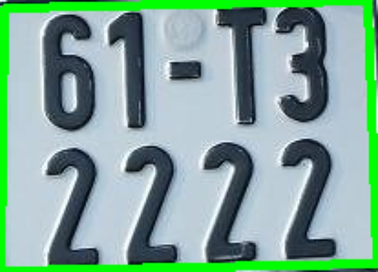
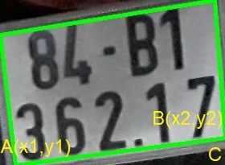

# LICENSE_PLATE using KNN and openCV

Chương trình nhận dạng biển số xe trong kho bãi, được dùng cho biển số xe Việt Nam cả 1 và 2 hàng. Sử dụng xử lý ảnh OpenCV và thuật toán KNN. Chi tiết mình sẽ làm một video youtube cập nhật sau.

HOW TO USE:
* To test on image, run `Image_test2.py`. Remember to change the path of image in `data/image/`
* To test on video, run `Video_test2.py`. Remeber to record the video with size 1920x1080 
* Use `GenData.py` to generate KNN data points which is `classifications.txt` and `flattened_images.txt`
* `training_chars.png` is the input of `GenData.py`
* `Preprocess.py` contains functions for image processing
* Remember to set up neccesary libraries in `requirements.txt` 

Đọc file `Nhận diện biển số xe.docx` để biết thêm lý thuyết.

## CÁC BƯỚC CHÍNH TRONG CỦA 1 BÀI TOÁN NHẬN DẠNG BIỂN SỐ XE

1. License Plate Detection
2. Character Segmentation
3. Character Recognition

<i>Figure 1. The main stages in the license plate recoginition algorithm </i>

## PHÁT HIỆN VÀ TÁCH BIỂN SỐ:
**The main stages in detecting and extract the license plate**
1. Taking picture from the camera
2. Gray scaling
3. Increasing the contrast level
4. Noise Decreasing by Gaussian filter
5. Adaptive threshold for image binarization
6. Canny Edge detection
7. Detect the plate by drawing contours and if..else

<i>Figure 2. The main stages in detecting and extract the license plate </i>

Đầu tiên từ clip ta sẽ cắt từng frame ảnh ra từ clip đầu vào để xử lý, tách biển số. Ở phạm vi đồ án này, ý tưởng chủ yếu là nhận diện được biển số từ sự thay đổi đột ngột về cường độ ánh sáng giữa biển số và môi trường xung quanh nên ta sẽ loại bỏ các dữ liệu màu sắc RGB bằng cách chuyển sang ảnh xám. Tiếp theo ta tăng độ tương phản với hai phép toán hình thái học Top Hat và Black Hat để làm nổi bật thêm biển số giữa phông nền, hỗ trợ cho việc xử lý nhị phân sau này. Sau đó, ta giảm nhiễu bằng bộ lọc Gauss để loại bỏ những chi tiết nhiễu có thể gây ảnh hưởng đến quá trình nhận diện, đồng thời làm tăng tốc độ xử lý.

<i>Figure 3. Maximize Contrast </i>

Việc lấy ngưỡng sẽ giúp ta tách được thông tin biển số và thông tin nền, ở đây chọn lấy ngưỡng động (Adaptive Threshold). Tiếp đó ta sử dụng thuật toán phát hiện cạnh Canny để trích xuất những chi tiết cạnh của biển số. Trong quá trình xử lý máy tính có thể nhầm lẫn biển số với những chi tiết nhiễu, việc lọc lần cuối bằng các tỉ lệ cao/rộng hay diện tích của biển số sẽ giúp xác định được đúng biển số. Cuối cùng, ta sẽ xác định vị trí của biển số trong ảnh bằng cách vẽ Contour bao quanh. 

<i>Figure 4. Canny Edge Detection </i>

<i>Figure 5. Drawing contour and extract the information </i>

## Phân tách kí tự:

Đầu tiên cần xoay biển số về đúng chính diện

Phương pháp xoay ảnh sử dụng ở đây là:
* Lọc ra tọa độ 2 đỉnh A,B nằm dưới cùng của biển số
*	Từ 2 đỉnh có tọa độ lần lượt là A(x1, y1) và B(x2,y2) ta có thể tính được cạnh đối và cạnh kề của tam giác ABC
*	Tính góc quay bằng hàm tan()
*	Xoay ảnh theo góc quay đã tính. Nếu ngược lại điểm A nằm cao hơn điểm B ta cho góc quay âm

                      

<i>Figure 6. Rotation </i>

Từ ảnh nhị phân, ta lại tìm contour cho các kí tự (phần màu trắng). Sau đó vẽ những hình chữ nhật bao quanh các kí tự đó. Tuy nhiên việc tìm contour này cũng bị nhiễu dẫn đến việc máy xử lý sai mà tìm ra những hình ảnh không phải kí tự. Ta sẽ áp dụng các đặc điểm về tỉ lệ chiều cao/rộng của kí tự, diện tích của kí tự so với biển số 

<i>Figure 7. Character Segmentation </i>

## Nhận dạng kí tự ##
**Character Recognition**

KNN là một trong những thuật toán học có giám sát đơn giản nhất trong Machine Learning, hoạt động theo quy trình gồm 4 bước chính:
1.	Xác định tham số K (số láng giềng gần nhất). 
2.	Tính khoảng cách từ điểm đang xét đến tất cả các điểm trong tập dữ liệu cho trước
3.	Sắp xếp các khoảng cách đó theo thứ tự tăng dần
4.	Xét trong tập K điểm gần nhất với điểm đang xét, nếu số lượng điểm của loại nào cao hơn thì coi như điểm đang xét thuộc loại đó

Vì mỗi kí tự có kích thước khác nhau xử lý phức tạp nên cần chuẩn hóa hình ảnh lại với kích thước cao:rộng là 30:20 pixels. Thay vì mỗi kí tự đưa vào mô hình để máy nhận diện thì những kí tự này sẽ được ta gắn nhãn bằng những phím bấm trên máy tính. Sau khi gắn nhãn hết các kí tự ta sẽ lưu hai file `.txt` là `classifications.txt` và `flattened_images.txt`. File `classifications.txt` có nhiệm vụ lưu các mã ASCII của các kí tự đó và file `flattened_images.txt` sẽ lưu giá trị các điểm ảnh có trong hình ảnh kí tự (hình 20x30 pixel có tổng cộng 600 điểm ảnh có giá trị 0 hoặc 255)

Tiếp đó ta thực hiện đưa ảnh đang xét vào và tính khoảng cách đến tất cả các điểm trong mẫu, kết quả sẽ là mã ASCII đại điện cho hình ảnh đó. Cuối cùng ta in biển số xe ra hình. 

                      

<i>Figure 8. Print out license plate number </i>

## Nhận dạng kí tự ##
**Result**

| Category |	Total number of plates	| Nunmber of found plates | Percentage(%) |
|:---------------------:|:----------------------:|:-------------------------:|:-------:|
|1 row plate  |	370     |	182                  |	49,2          | 
|2 row plate	| 2349 |	924 |	39,3 |

<i>Table 1. Percentage of finding the license plate in the picture  </i>

Khi ta quay theo nhiều góc độ, nhiều vị trí dẫn đến khi tính toán diện tích, tỉ lệ cao/rộng của biển số không còn thỏa điều kiện đặt ra nên đã bị loại. Biển số có thể bị ảnh hưởng bởi những chi tiết ngoài nên khi xấp xỉ contour không ra hình tứ giác, dẫn đến cũng gây mất biển số. Lỗi này đặc biệt xảy ra ở những xe ô tô vì ô tô thường có nền xung quanh biển số là những vật liệu phản chiếu ánh sáng mạnh, gây ảnh hưởng lớn đến quá trình xác định vùng biển số. 

                      

<i>Figure 9. Uncorrect plate extraction </i>

Trong quá trình xử lý, việc xử lý nhị phân cũng đóng vai trò quan trọng, ảnh bị nhiễu và bản thân biển số bị tối, dính nhiều bụi dẫn đến khi xử lý nhị phân sẽ bị đứt đoạn và vẻ contour bị sai, để khắc phục cần sử dụng những phép toán hình thái học như phép nở, phép đóng để làm liền những đường màu trắng trong ảnh nhị phân.

                      

<i>Figure 10. Error in binary image </i>

|Category|Nunmber of found plates|100% correctly recognizized	| 1-character uncorrect |	2-character uncorrect	| above 3-character uncorrect |
|:-------:|:---------------------:|:----------------------:|:-------------------------:|:--------------------:|:--------------------:|
|1 row plates|	182	| 61 |	88 |	19	| 14 |
|Percentage (%)|   100   |	33,5 |	48,4 |	10,4	| 7,7 |

<i>Table 2. Error rate of character recognition in 1 - row license plate </i>

|Category|Nunmber of found plates|100% correctly recognizized	| 1-character uncorrect |	2-character uncorrect	| above 3-character uncorrect |
|:-------:|:---------------------:|:----------------------:|:-------------------------:|:--------------------:|:--------------------:|
|2 row plates|	924	| 286	| 273 |	175 |	190|
|Percentage (%)|   100  |	31 |	29,5 |	18,9	| 20,6|

<i>Table 3. Error rate of character recognition in 2 - row license plate </i>

Nhìn chung mô hình nhận diện KNN cũng khá tốt, có những kí tự dù bị mờ, bị nghiêng vẫn nhận diện đúng. Điều này một phần nhờ vào chương trình đã xoay biển số lại cho để tăng khả năng nhận diện, cho dù nghiêng thì kí tự cũng chỉ nghiêng từ 3° đến 7°. Tuy nhiên vẫn còn nhầm lẫn nhiều giữa các kí tự như số 1 với số 7. Chữ G, chữ D, số 6 với số 0. Chữ B với số 8...

## Đánh giá và hướng phát triển
**Conclusion and future work**

### Ưu điểm  
**Advantages:**

* Dễ cài đặt và sử dụng.
* Khá nhẹ nên máy tính với cấu hình yếu cũng có thể xử lý mượt mà so với các thuật toán khác như CNN, SVM.
*	Phù hợp cho đối tượng sinh viên muốn tìm hiểu căn bản về xử lý ảnh hay trí tuệ nhân tạo.

### Khuyết điểm  
**Disadvantages:**

*	Khả năng nhận diện của KNN còn thấp, khi tập dữ liệu quá nhiều sẽ tăng thời gian xử lý vì phải quét hết tập dữ liệu train.
*	Nhận diện kém với sự phản chiếu của biển số, sự di ảnh, chói sáng từ môi trường ngoài, những biển có phần chữ số không rõ ràng, với biển số xe ô tô 

### Hướng phát triển 
**Future Work:**

* Cần thay đổi thuật toán nhận diện KNN sang những thuật toán khác tinh vi và phức tạp hơn như CNN, SVM hoặc có thể sử dụng những bộ thư viện đã có sẵn trên thế giới như YOLO, YOLOv3...
* Sử dụng camera chuyên dụng cho việc nhận diện biển số xe vì có khả năng chống chịu với sương mù, đêm tối, chói sáng...
* Sử dụng các thuật toán xử lý ảnh khác để xác định vị trí biển số tốt hơn như phương pháp biến đổi Hough để nhận diện đường thẳng, xác định bằng màu sắc, những thuật toán làm hạn chế sự di ảnh khi xe đang di chuyển.

